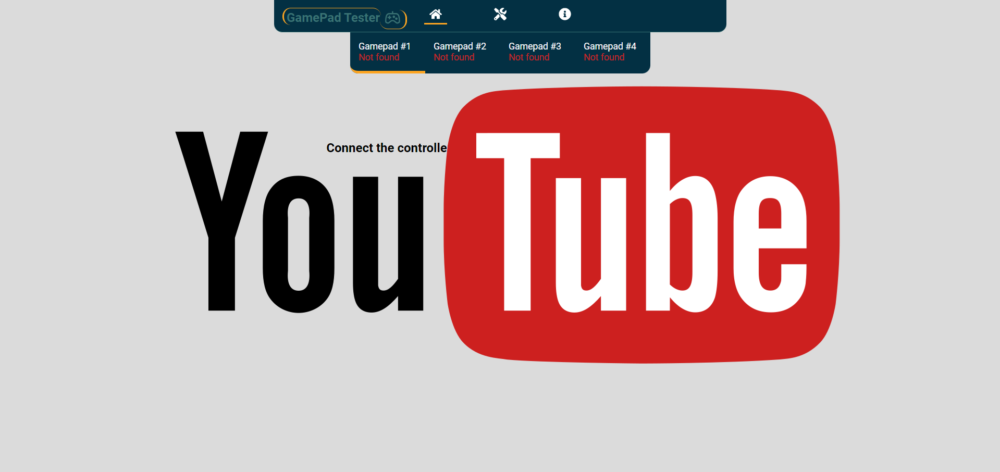
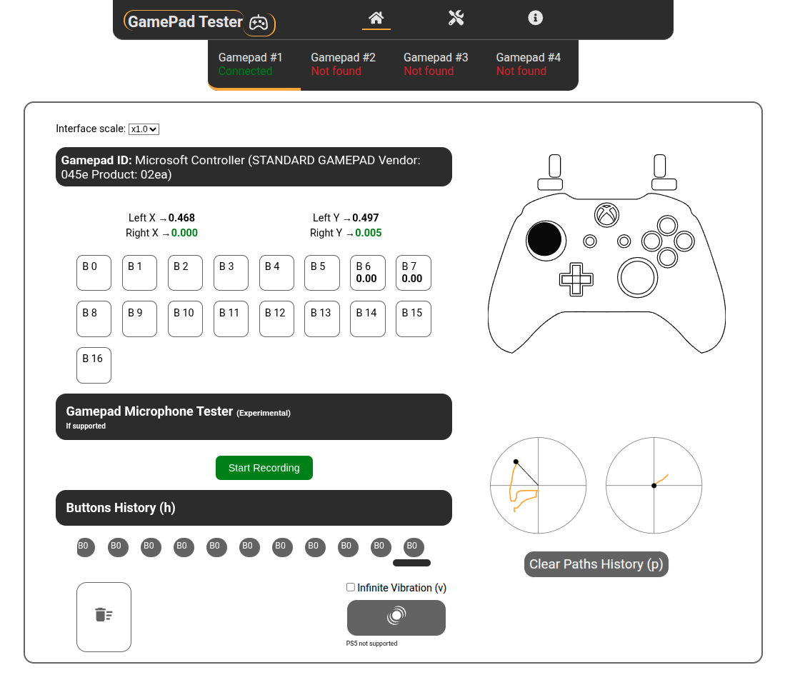
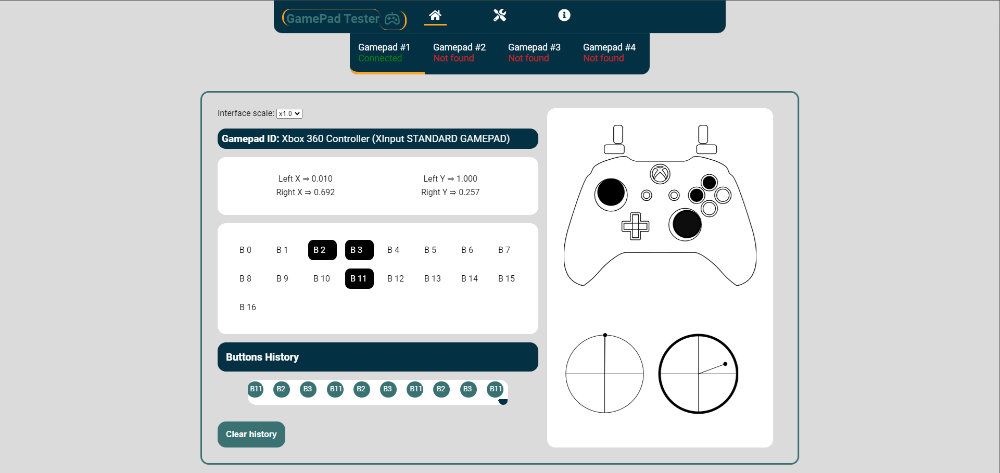

# GamePad Tester

React App created for xbox and ps controller.

> Check App here! >> https://gpadtester.com

### Technologies:

React Icons

## App Video:

## App Screenshots:

#### waiting for connection

#### view after detect connected gamepad

